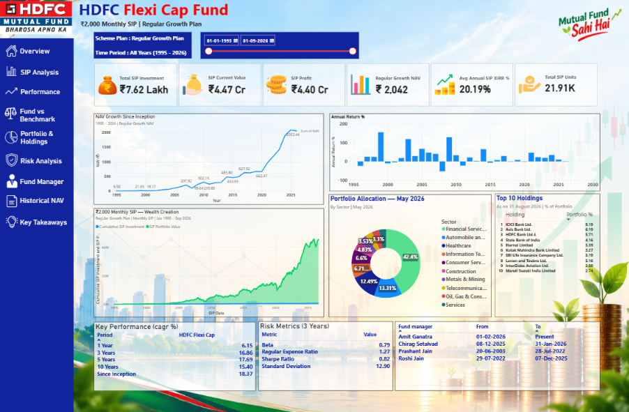
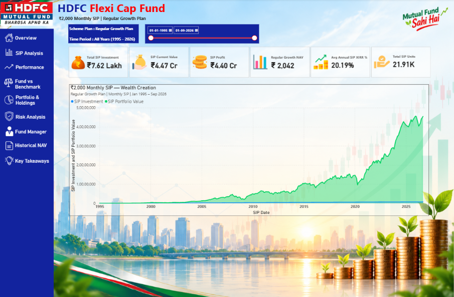
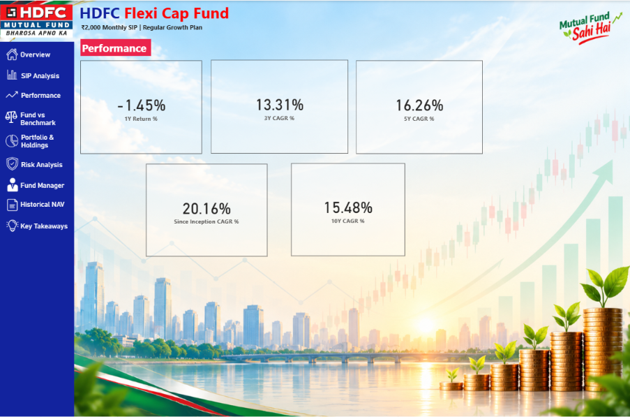
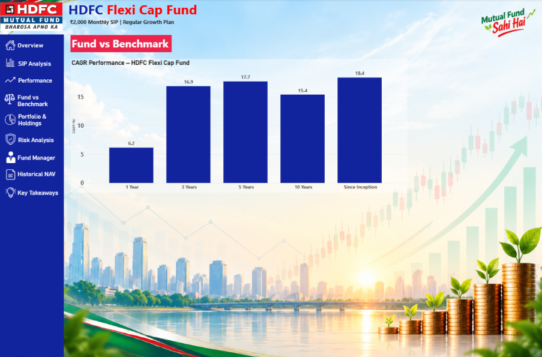
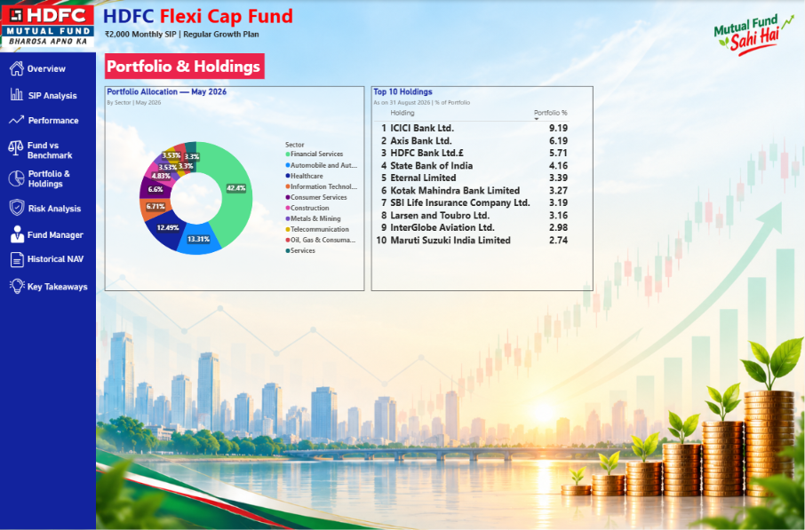
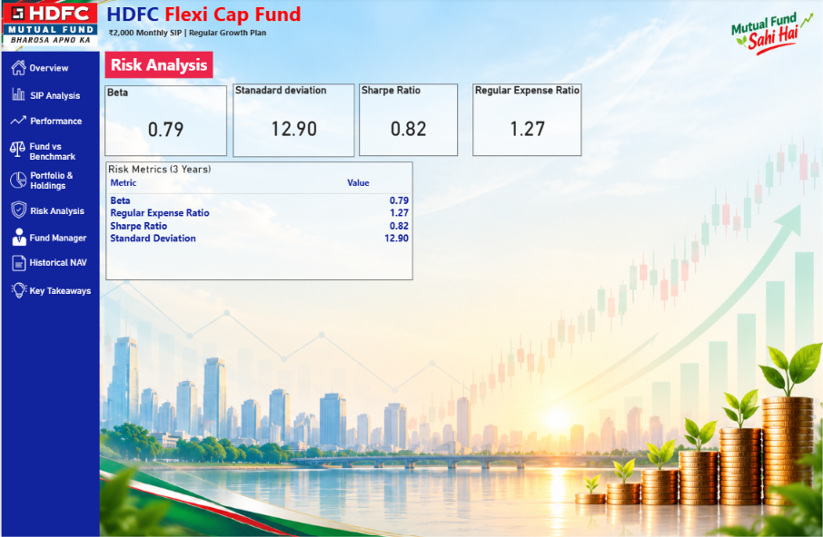
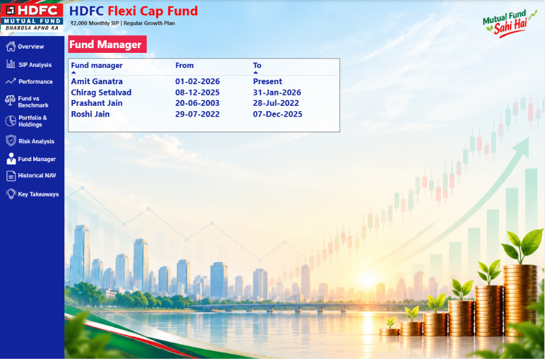
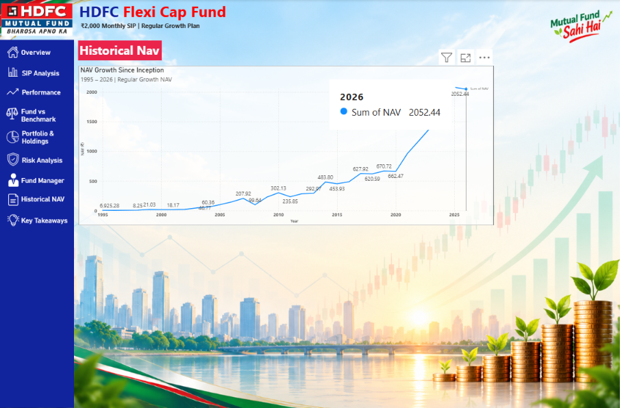
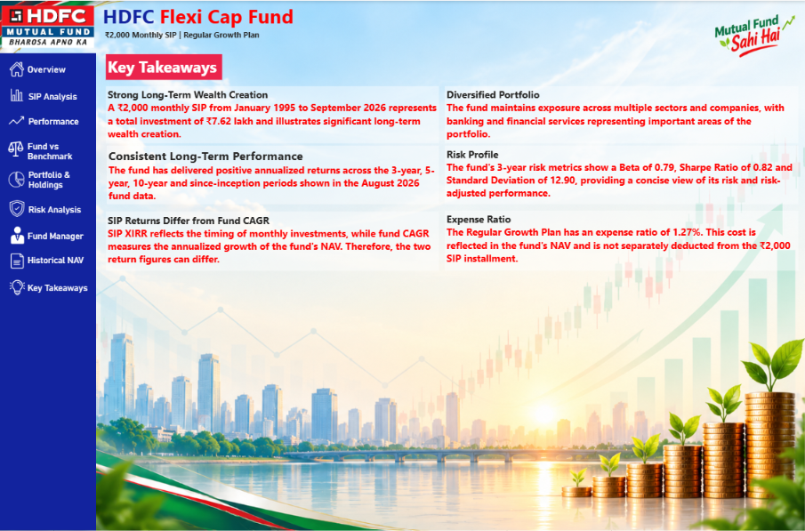

# HDFC Flexi Cap Fund — ₹2,000 Monthly SIP Power BI Dashboard
Financial Analytics / Investment Analytics portfolio project built in Microsoft Power BI.

## Project

This dashboard models a **₹2,000 monthly SIP** in HDFC Flexi Cap Fund from **January 1995 to September 2026** using historical NAV data.

---

## 📊 Dashboard Pages

The Power BI dashboard contains the following 9 pages:

1. **Overview**
2. **SIP Analysis — ₹2,000 Monthly SIP**
3. **Performance**
4. **Fund Vs Benchmark**
5. **Portfolio & Holdings**
6. **Risk Analysis**
7. **Fund Manager**
8. **Historical NAV**
9. **Key Takeaways**

---

# 📸 Dashboard Screenshots

## 1. Overview



High-level overview of HDFC Flexi Cap Fund and its major performance indicators.

---

## 2. SIP Analysis — ₹2,000 Monthly SIP



Dedicated analysis of the modeled ₹2,000 monthly SIP and its long-term wealth creation.

---

## 3. Performance



Analysis of the fund's long-term performance across different investment periods.

---

## 4. Fund Vs Benchmark



Comparison of HDFC Flexi Cap Fund performance against the selected benchmark.

---

## 5. Portfolio & Holdings



Portfolio allocation and major holdings of HDFC Flexi Cap Fund.

---

## 6. Risk Analysis



Key risk and efficiency metrics of the fund.

---

## 7. Fund Manager



Historical fund manager information and timeline.

---

## 8. Historical NAV



Annual historical NAV analysis from 1995 to 2026.

---

## 9. Key Takeaways



Summary of the major insights from the fund and SIP analysis.

---

# 💰 SIP Analysis — ₹2,000 Monthly SIP

The dedicated SIP Analysis page evaluates the modeled wealth creation from investing **₹2,000 every month** in HDFC Flexi Cap Fund from **January 1995 to September 2026**.

### Investment & Wealth Creation

| Metric | Value |
|---|---:|
| Monthly SIP | ₹2,000 |
| Investment Period | January 1995 – September 2026 |
| **Total Amount Invested** | **₹7.62 Lakh** |
| Total SIP Units | 21.91K |
| Latest Regular Growth NAV | ₹2,041.965 |
| **Current Portfolio Value** | **₹4.47 Cr** |
| **Profit / Wealth Created** | **₹4.40 Cr** |
| **SIP Return** | **≈ 5,773%** |
| **SIP XIRR** | **20.19%** |

### 📈 Wealth Creation Summary

- **Total Amount Invested:** ₹7.62 Lakh
- **Wealth Created / Profit:** ₹4.40 Cr
- **Current Portfolio Value:** ₹4.47 Cr
- **SIP XIRR:** 20.19%

In this illustrative historical model, a total investment of **₹7.62 Lakh** through a ₹2,000 monthly SIP results in a modeled portfolio value of approximately **₹4.47 Cr**, representing approximately **₹4.40 Cr of wealth created**.

### Methodology

**Monthly Units Purchased**

Investment ÷ NAV

**Current Modeled Value**

Total SIP Units × Latest Regular Growth NAV

**SIP Profit**

Current Portfolio Value − Total Amount Invested

**SIP XIRR**

Calculated using monthly SIP cash flows and a final valuation on **10-Sep-2026**.

> This is an analytical illustration, not an actual investor account statement. Historical results do not guarantee future returns.

---

# 📈 Performance

### NAV-Based Calculated Measures

| Period | Return |
|---|---:|
| 1 Year | -1.45% |
| 3 Years CAGR | 13.31% |
| 5 Years CAGR | 16.26% |
| 10 Years CAGR | 15.48% |
| Since Inception CAGR | 20.16% |

### Official August 2026 Performance Table

| Period | HDFC Flexi Cap |
|---|---:|
| 1 Year | 6.15% |
| 3 Years | 16.86% |
| 5 Years | 17.69% |
| 10 Years | 15.40% |
| Since Inception | 18.37% |

---

# ⚠️ Risk Metrics

| Metric | Value |
|---|---:|
| Beta | 0.79 |
| Standard Deviation | 12.90 |
| Sharpe Ratio | 0.82 |
| Regular Expense Ratio | 1.27% |

---

# 🛠️ Tools & Technologies

- Microsoft Power BI
- Power Query / M
- DAX
- Microsoft Excel / XLSX
- Financial Analytics
- Data Visualization

---

# 📂 Repository Structure

```text
HDFC-Flexi-Cap-SIP-PowerBI/
│
├── README.md
├── LICENSE
├── .gitignore
│
├── PowerBI/
│   └── HDFC_Flexi_Cap_Fund.pbix
│
├── Data/
│   └── HDFC_Flexi_Cap_PowerBI_Data.xlsx
│
├── Documentation/
│   └── HDFC_Flexi_Cap_SIP_Power_BI_Project_Documentation.pdf
│
├── Screenshots/
│   ├── 01_Overview.png
│   ├── 02_SIP_Analysis.png
│   ├── 03_Performance.png
│   ├── 04_Fund_Vs_Benchmark.png
│   ├── 05_Portfolio_Holdings.png
│   ├── 06_Risk_Analysis.png
│   ├── 07_Fund_Manager.png
│   ├── 08_Historical_NAV.png
│   └── 09_Key_Takeaways.png
│
└── Assets/
